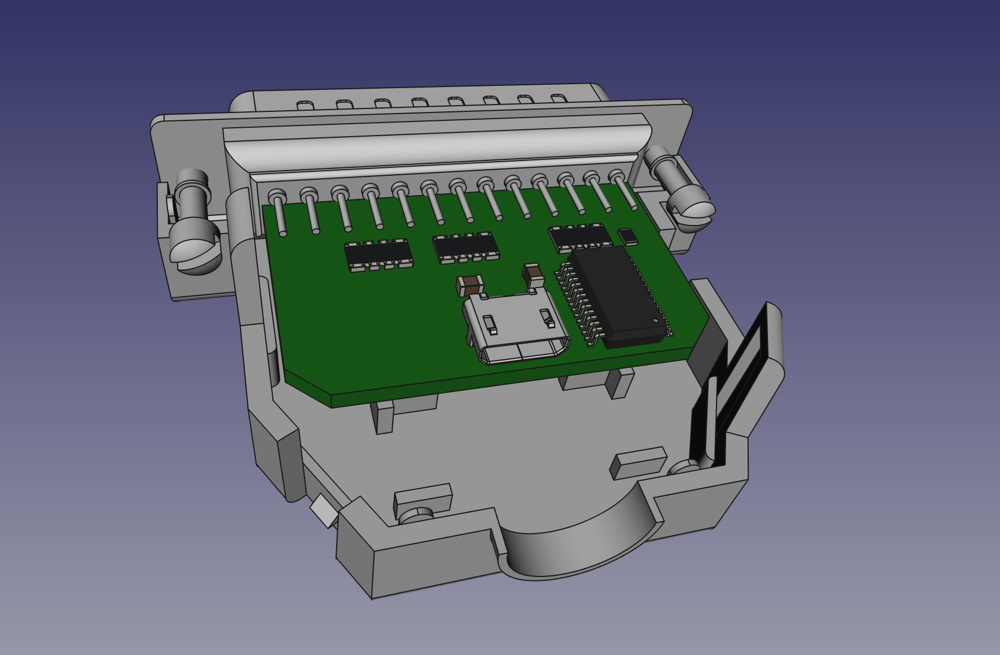

# LPT Capture

This is a rendition of [LptCap](https://www-user.tu-chemnitz.de/~heha/basteln/PC/LptCap/index.en.htm)

Differences:  
* Source in KiCAD
* SOIC main chip
* 0805 passives
* MicroUSB
* Snap-together backshell without screws

PCB: https://oshpark.com/shared_projects/r3SkY0pc  
BOM: https://www.digikey.com/short/30bjf4nq

