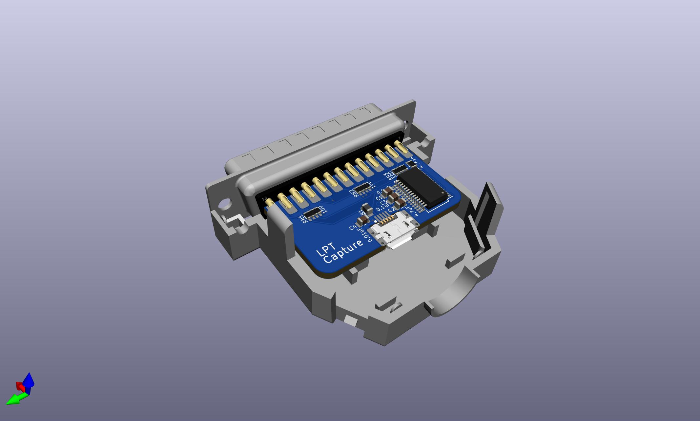
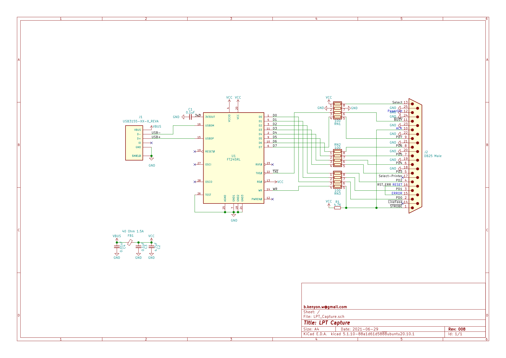

# LPT Capture

This is a rendition of [LptCap](https://www-user.tu-chemnitz.de/~heha/basteln/PC/LptCap/index.en.htm)

Differences from the original LptCap:  
* Source in KiCAD instead of Eagle
* SSOP chip instead of QFN
* 0805 passives instead of 0603
* MicroUSB port, mid-mount
* Snap-together backshell instead of screws & nuts
* Pullups to VCC instead of 3V3OUT
* VBUS & VCC power conditioning per FT245R datasheet

PCB: [OSHPark](https://oshpark.com/shared_projects/DqbtiuyI), [PCBWAY](https://www.pcbway.com/project/shareproject/LPT_Capture.html)  
BOM: [DigiKey](https://www.digikey.com/short/wqdmr8p4)

The hole in the backshell is 11mm, and the special mid-mount usb jack is right in the center.  
Some cables possibly won't fit, but most do, especially ones with oval shaped plugs like the standard [Raspberry Pi cable](https://thepihut.com/collections/raspberry-pi-cables/products/raspberry-pi-micro-usb-cable).  
The DigiKey BOM cart above includes a cable which you can remove if you don't need it.

The DB25 is wired to plug directly into a host computer in place of a printer cable.

The FTDI chip provides a virtual usb-serial comm port. Use any comm program like PuTTY or TeraTerm or minicom to etc to read the data. It doesn't matter what baud rate you select in the comm program.

The chip can both send and receive, but this circuit is basic and only implements receiving. You can only read, not write.

Example usage: https://github.com/bkw777/TPDD_stuff  
(In that example, a disk sector dump utility has to write data from the disk out to the parallel port, because the single serial port is occupied by the disk drive.)  
