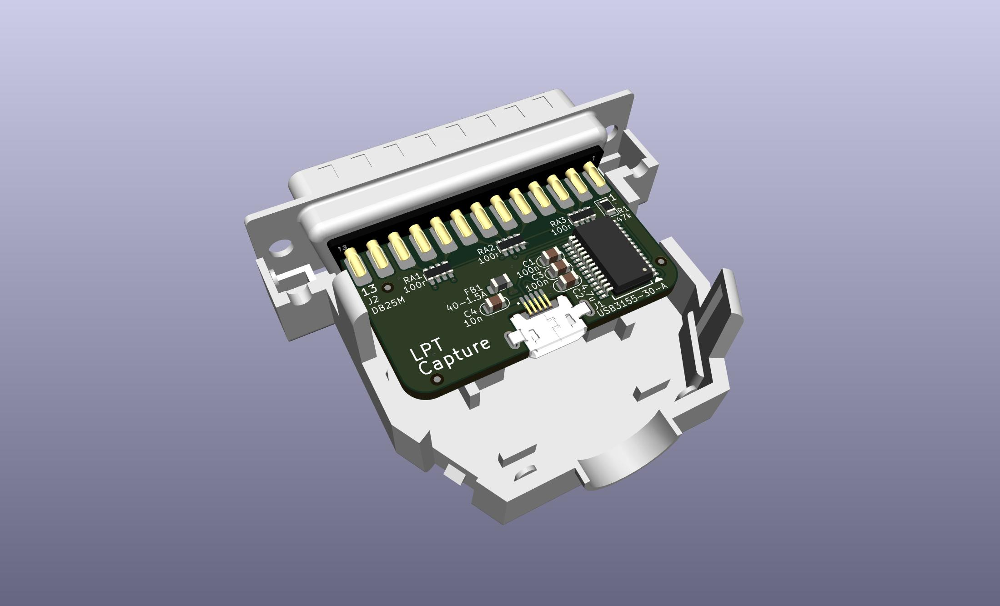
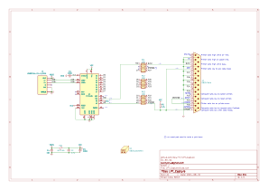

# LPT Capture

This is a refinement of [LptCap](https://www-user.tu-chemnitz.de/~heha/basteln/PC/LptCap/index.en.htm)

Differences from the original LptCap:  
* Re-drawn in KiCad instead of Eagle
* SSOP chip instead of QFN
* 0805 passives instead of 0603
* microusb port
* mid-mount usb port so the plug is centered in the opening to avoid strain on the port
* Snap-together backshell instead of screws & nuts
* Pullups to VCC instead of 3V3OUT
* VBUS & VCC power conditioning per FT245R datasheet

PCB: [OSHPark](https://oshpark.com/shared_projects/DqbtiuyI), [PCBWAY](https://www.pcbway.com/project/shareproject/LPT_Capture.html)  
BOM: [DigiKey](https://www.digikey.com/short/wqdmr8p4)

The hole in the backshell is 11mm, and the usb port is positioned right in the center of the hole.  
Most cables fit, but some cables possibly won't fit. Especially almost any cable with an oval shaped plug like the [Raspberry Pi cable](https://thepihut.com/collections/raspberry-pi-cables/products/raspberry-pi-micro-usb-cable) will fit.  
The DigiKey BOM above also includes a cable which fits for reference & completeness, which you can remove if you don't need it.

The DB25 is wired to plug directly onto a computers parallel printer port in place of a printer cable.

The FTDI chip provides a virtual usb-serial comm port. Use any serial comm program like PuTTY or TeraTerm or minicom etc to read the data. It doesn't matter what baud rate you select in the comm program.

The FTDI chip can both send and receive, but this circuit is basic and only implements receiving. You can only read, not write.
