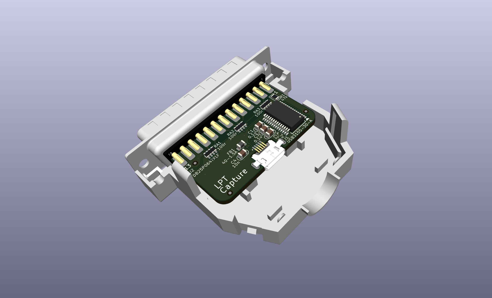
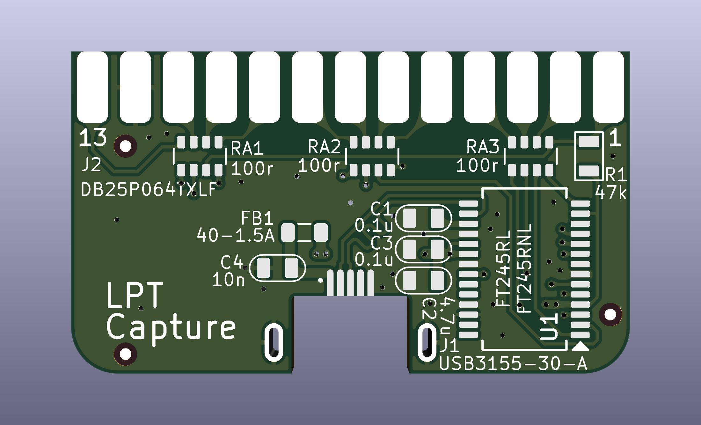
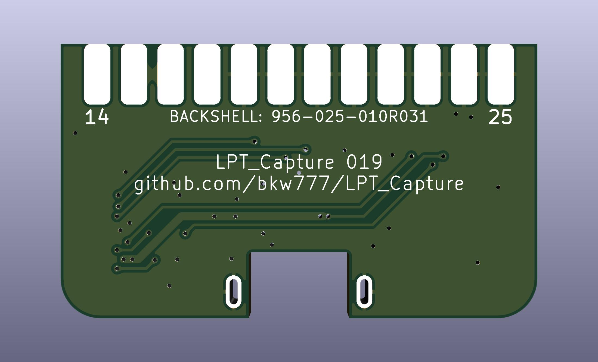
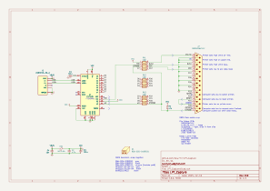

# LPT Capture
Capture the output from a parallel printer port.

PCB: [PCBWAY](https://www.pcbway.com/project/shareproject/LPT_Capture.html)  
BOM: [DigiKey](https://www.digikey.com/short/j7w00c9c)

# Usage
Plug the device directly into the parallel printer port on a vintage computer.  
Connect a modern machine to the mico-usb port.

The device appears as a usb-serial adapter to the modern machine. Drivers are standard in any modern os or platform.  
Use any serial comm program like PuTTY or TeraTerm or minicom or gnu screen etc to read the COM port.  
It doesn't matter what baud rate you select in the comm program.

Print to the LPT port on the vintage machine.

Read the data from the COM port on the modern machine.

This device essentially takes the place of a printer, and only only impliments the basic original Centronics interface, no ieee1284 epp ecp bi-directional etc.

# Other Versions
The "fancy" versions add ONLINE, /SELIN, /RESET, and LEDS for ONLINE & /SELIN.  
The c36 version has a Centronics 36F connector like a printer has, for use with computers that don't have an IBM PC style DB25 parallel printer port. Use the printer cable to connect the device to the computer.  
The Centronics version tries to impliment all possible signals including possibly questionable ones like supplying 5v power on pins 18 & 35.  
The main version is tested. None of these are tested yet.  
<!--[v2](../../tree/v2) DB25, MicroUSB, Adds the ONLINE, /SELIN, and /RESET signals - UNTESTED  -->

"db25_microusb_basic" <- the main branch is essentially this  
[db25_microusb_fancy](../../tree/db25_microusb_fancy)  
[db25_usbc_basic](../../tree/db25_usbc_basic)  
[db25_usbc_fancy](../../tree/db25_usbc_fancy)  
[c36_usbc_fancy](../../tree/c36_usbc_fancy) Centronics 36 connector

# Credits
[LptCap](https://www-user.tu-chemnitz.de/~heha/basteln/PC/LptCap/index.en.htm)

Differences from the original LptCap:  
* Re-drawn in KiCad instead of Eagle
* SSOP chip instead of QFN - easier to hand solder
* 0805 passives instead of 0603 - easier to hand solder
* microusb port instead of miniusb - cables are more common
* mid-mount usb port - positions the plug exactly centered in the cable opening
* Snap-together backshell instead of screws & nuts
* Pullups to VCC (5V) instead of 3V3OUT - LPT signals are 5V
* VBUS & VCC power conditioning per FT245R datasheet
