**NOTE: Only the top/default DB25_MicroUSB_BASIC version is tested and known good.**  
**All other versions are untested guesswork.**  
**I have built one DB25_USBC_Fancy and only barely tested just with power only, and the LEDs are too dim.**

# LPT Capture
Capture the output from a parallel printer port.

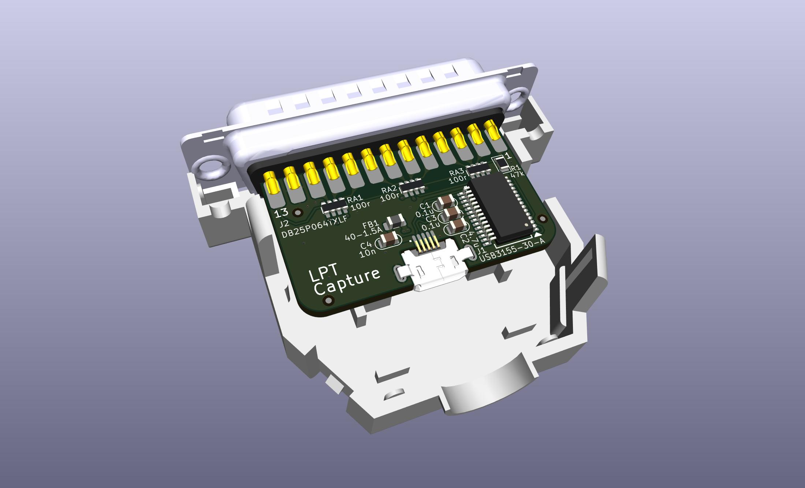
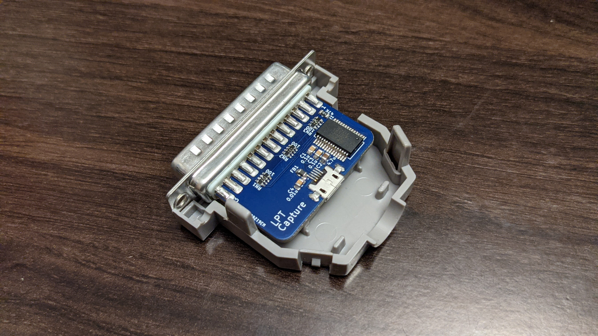
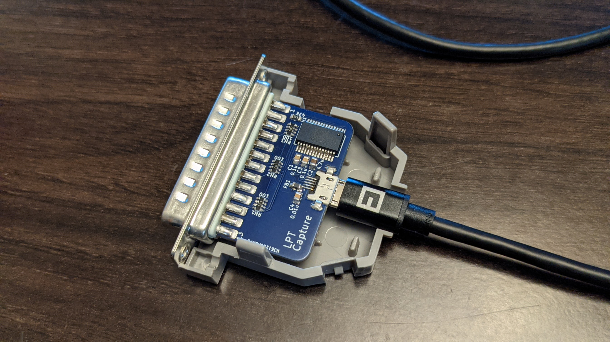
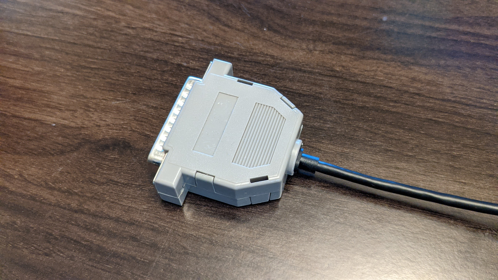
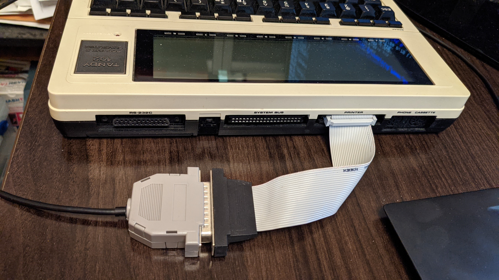
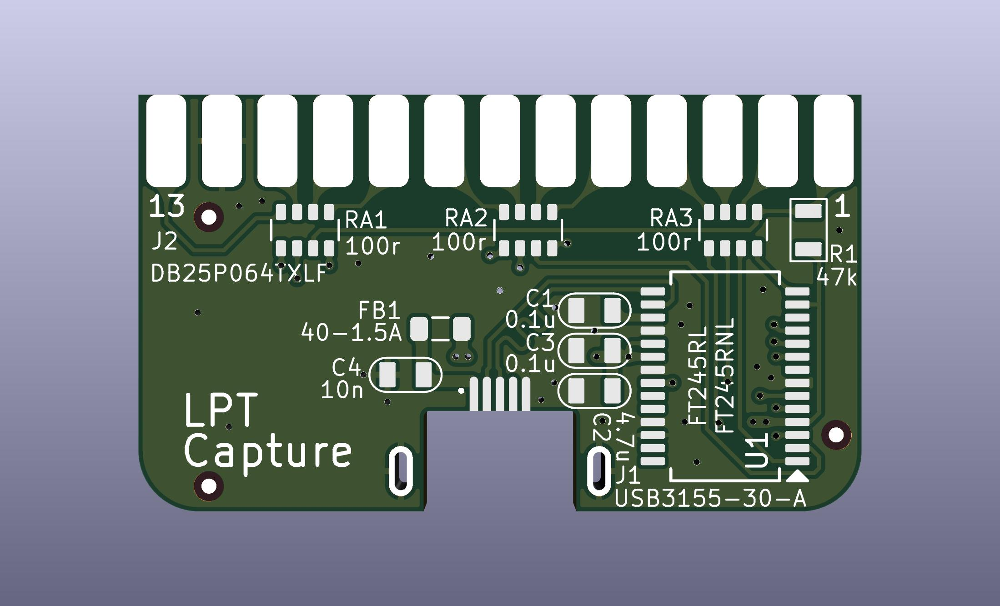
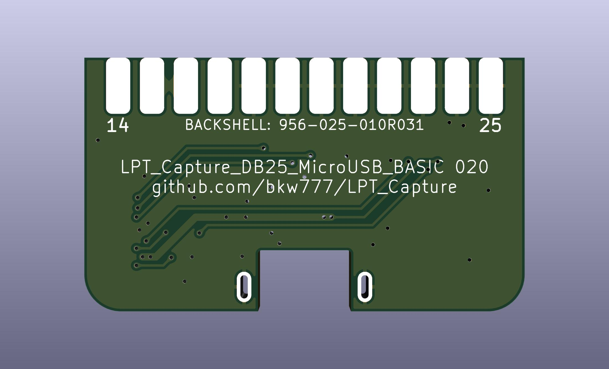
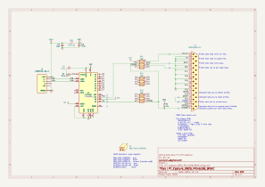

PCB: [PCBWAY](https://www.pcbway.com/project/shareproject/LPT_Capture.html)  
BOM: [DigiKey](https://www.digikey.com/short/j7w00c9c)

# Usage
Plug the device directly into the parallel printer port on a vintage computer.  
Connect a modern machine to the mico-usb port.

The device appears as a usb-serial adapter to the modern machine. Drivers are standard in any modern os or platform.  
Use any serial comm program like PuTTY or TeraTerm or minicom or gnu screen etc to read the COM port.  
It doesn't matter what baud rate you select in the comm program.

Print to the LPT port on the vintage machine.

Read the data from the COM port on the modern machine.

This device essentially takes the place of a printer, and only only impliments the basic original Centronics interface, no ieee1284 epp ecp bi-directional etc.

# Other Versions
The default "DB25 MicroUSB BASIC" version above is tested.  
None of the rest of these are tested yet.

[DB25 MicroUSB FANCY](README_DB25_MicroUSB_FANCY.md)  
[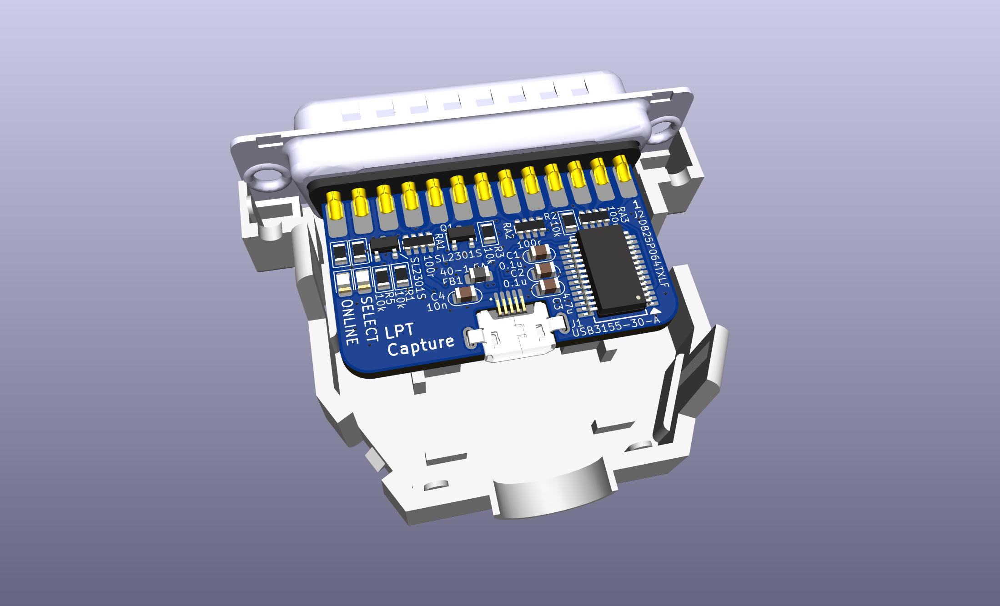](README_DB25_MicroUSB_FANCY.md)

[DB25 USBC BASIC](README_DB25_USBC_BASIC.md)  
[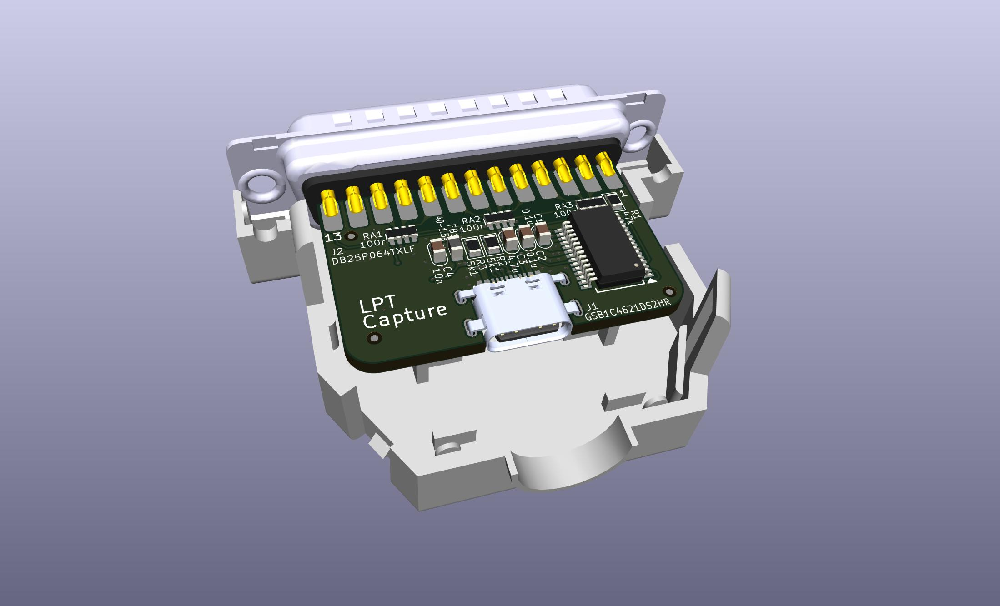](README_DB25_USBC_BASIC.md)

[DB25 USBC FANCY](README_DB25_USBC_FANCY.md)  
[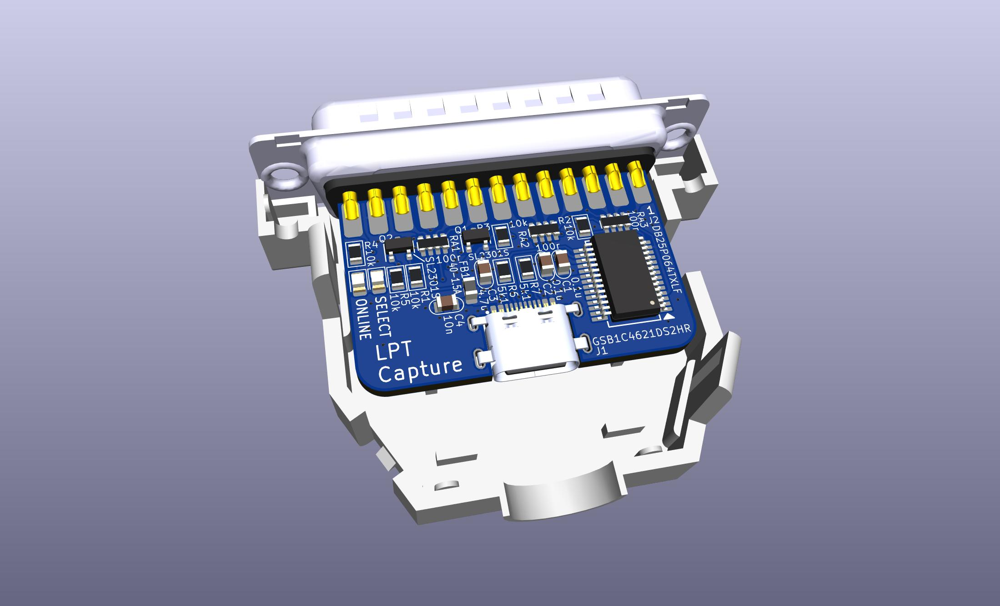](README_DB25_USBC_FANCY.md)

[CN36 USBC FANCY](README_CN36_USBC_FANCY.md)
[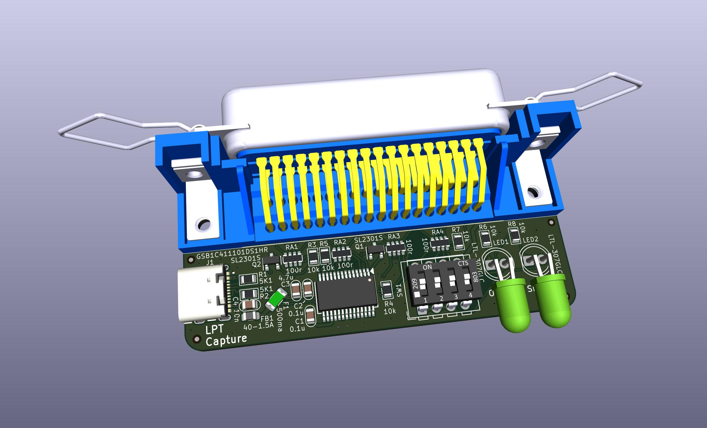](README_CN36_USBC_FANCY.md)

# Credits
[LptCap](https://www-user.tu-chemnitz.de/~heha/basteln/PC/LptCap/index.en.htm)

Differences:  
* KiCad instead of Eagle
* SSOP chip instead of QFN - easier to hand solder
* 0805 passives instead of 0603 - easier to hand solder
* microusb or usbc instead of miniusb
* mid-mount usb port - positions the plug in the center of the cable opening
* Snap-together backshell instead of screws & nuts
* VCCIO powered by VCC (5V) instead of 3V3OUT - LPT signals are 5V
* VBUS & VCC power conditioning per FT245R datasheet
* "fancy" versions impliment more signals (ONLINE, /SELIN, /RESET, /ERROR)
* CN36 version adds Peripheral Logic High and 5V power
