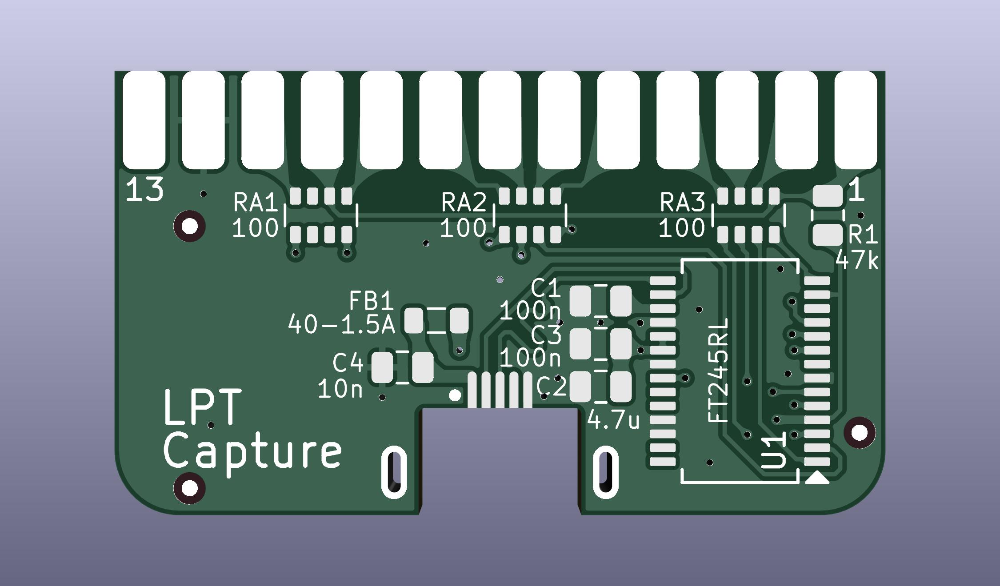

# LPT Capture
Capture the output from a parallel printer port.

-*- Untested USB-C version -*-

<!-- PCB: [PCBWAY](https://www.pcbway.com/project/shareproject/LPT_Capture.html)  -->
BOM: [PCB/out/LPT_Capture.bom.csv](PCB/out/LPT_Capture.bom.csv) <!-- [DigiKey](https://www.digikey.com/short/j7w00c9c) -->

# Usage
Plug the device directly into the parallel printer port on a vintage computer.  
Connect a modern machine to the mico-usb port.

The device appears as a usb-serial adapter to the modern machine. Drivers are standard in any modern os or platform.  
Use any serial comm program like PuTTY or TeraTerm or minicom or gnu screen etc to read the COM port.  
It doesn't matter what baud rate you select in the comm program.

Print to the LPT port on the vintage machine.

Read the data from the COM port on the modern machine.

# Credits
[LptCap](https://www-user.tu-chemnitz.de/~heha/basteln/PC/LptCap/index.en.htm)

Differences from the original LptCap:  
* Re-drawn in KiCad instead of Eagle
* SSOP chip instead of QFN - easier to hand solder
* 0805 passives instead of 0603 - easier to hand solder
* USB-C port instead of Mini-USB
* mid-mount usb port - positions the plug exactly centered in the cable opening
* Snap-together backshell instead of screws & nuts
* Pullups to VCC (5V) instead of 3V3OUT - LPT signals are 5V
* VBUS & VCC power conditioning per FT245R datasheet
