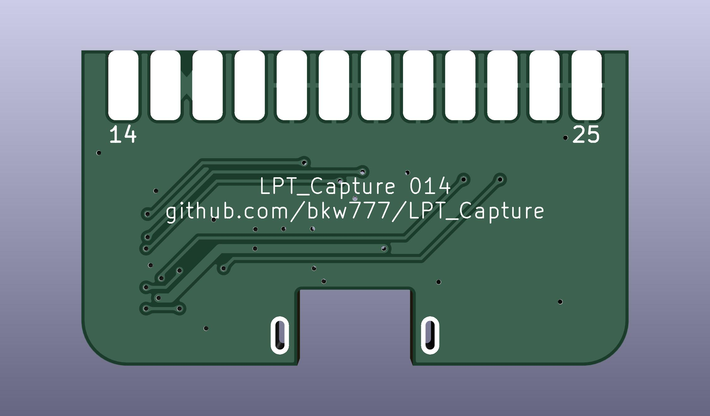

# LPT Capture

<!-- PCB: [OSHPark](https://oshpark.com/shared_projects/DqbtiuyI), [PCBWAY](https://www.pcbway.com/project/shareproject/LPT_Capture.html)  -->
BOM: [DigiKey](https://www.digikey.com/short/zvmrqr9d)

** This v2 branch is NOT TESTED **

Experimental additions vs the main branch:

* /RESET input: FT245R /RESET <- lpt /RESET  
* ONLINE output: invert /PWREN -> lpt ONLINE  
* /ERROR output: copy ONLINE -> lpt /ERROR  
* /SELIN input: block lpt /STROBE when lpt /SELIN high  
  pulldown /SELIN, /STROBE connected by default

# Credits
[LptCap](https://www-user.tu-chemnitz.de/~heha/basteln/PC/LptCap/index.en.htm)