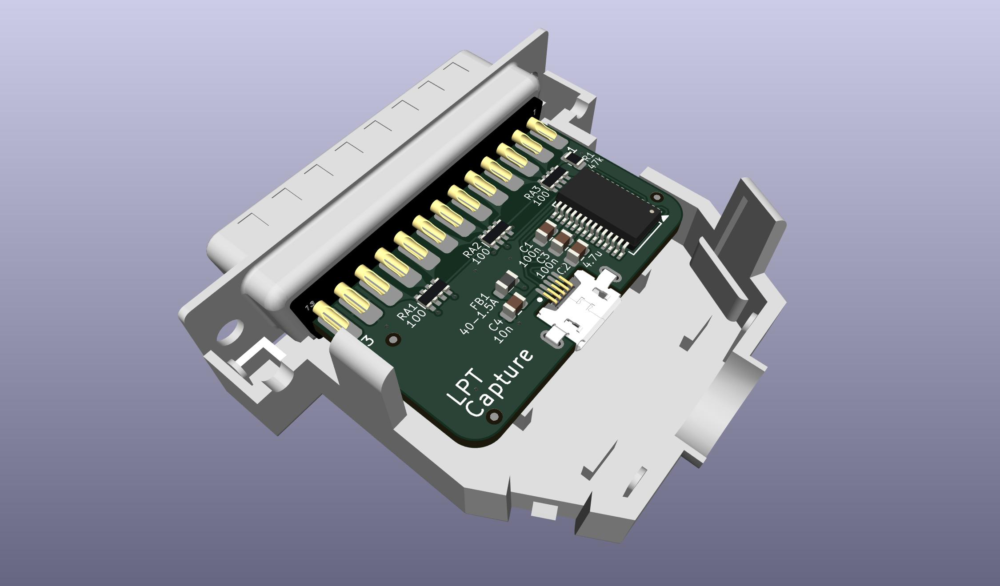

# LPT Capture
Capture the output from a parallel printer port.

PCB: [OSHPark](https://oshpark.com/shared_projects/DqbtiuyI), [PCBWAY](https://www.pcbway.com/project/shareproject/LPT_Capture.html)  
BOM: [DigiKey](https://www.digikey.com/short/p8p4nv40)

2025/11/30 The FT245RL chip used here is now EOL. Existing stock will be running out starting now.

A standard 1.6mm thick pcb fits between the solder cups of the specific DB25M plug in the BOM.  
If you need to use some other part, you may want to use 1.2mm thick pcb for a better fit.

The DigiKey cart includes a USB cable that fits in the housing just for reference & completeness which you may want to remove.

# Usage
Plug the device directly into the parallel printer port on a vintage computer.  
Connect a modern machine to the mico-usb port.  

The device appears as a usb-serial adapter to the modern machine. Drivers are standard in any modern os or platform.  
Use any serial comm program like PuTTY or TeraTerm or minicom or gnu screen etc to read the COM port.  
It doesn't matter what baud rate you select in the comm program.  

Print to the LPT port on the vintage machine.

Read the data from the COM port on the modern machine.

# Credits
This is a refinement of [LptCap](https://www-user.tu-chemnitz.de/~heha/basteln/PC/LptCap/index.en.htm)

Differences from the original LptCap:  
* Re-drawn in KiCad instead of Eagle
* SSOP chip instead of QFN - easier to hand solder
* 0805 passives instead of 0603 - easier to hand solder
* microusb port instead of miniusb - cables are more common
* mid-mount usb port - plug exactly centered in the opening for less strain on all parts
* Snap-together backshell instead of screws & nuts
* Pullups to VCC (5V) instead of 3V3OUT - LPT signals are 5V
* VBUS & VCC power conditioning per FT245R datasheet
