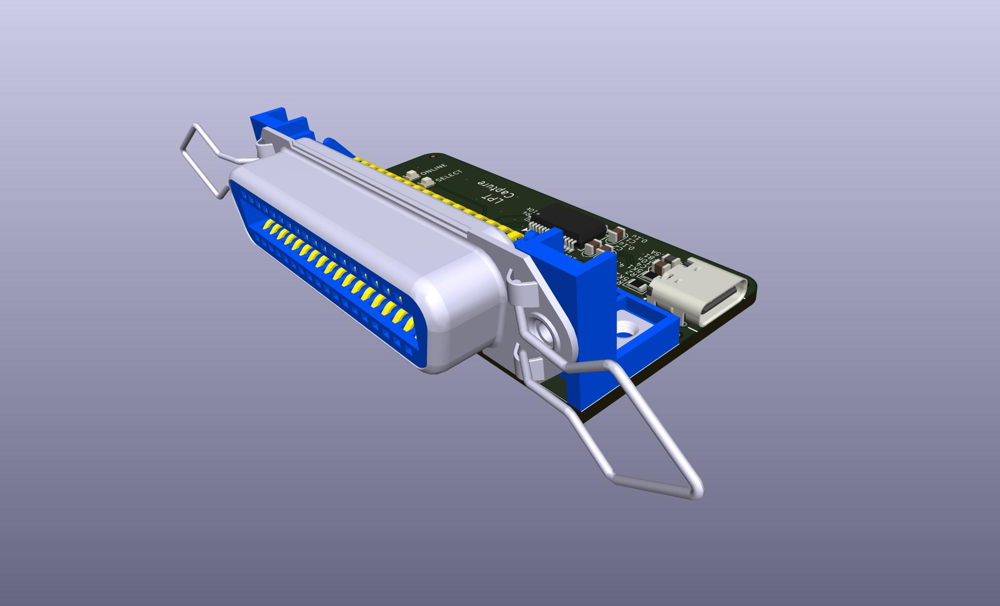
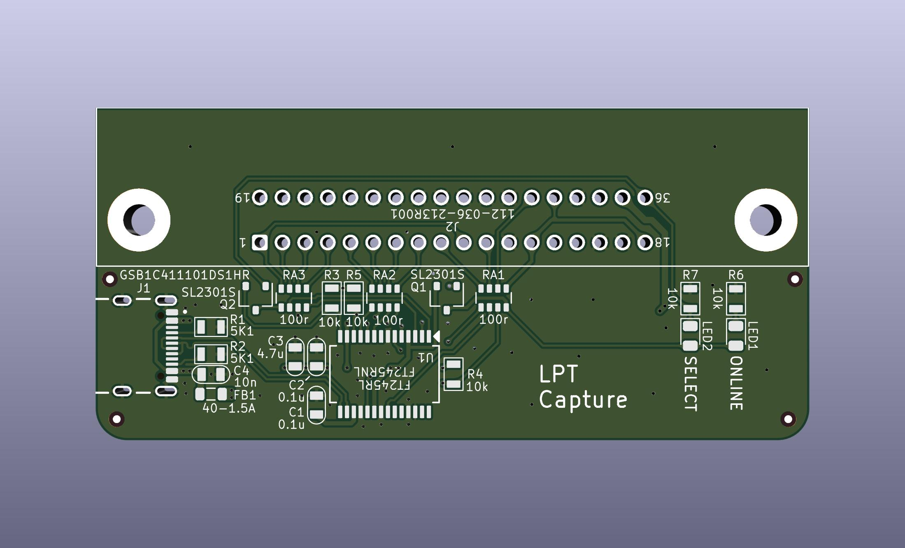
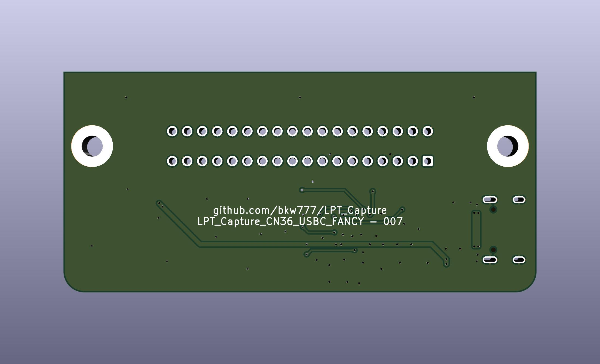
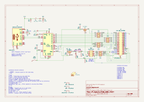

# LPT Capture
Capture the output from a parallel printer port.

WIP NOT TESTED

* Centronics 36F  
* USB-C  
* ONLINE, /SELIN, /RESET signals  
* LEDS for ONLINE & /SELIN

This version is useful for hosts that don't have a standard IBM style db25 parallel printer port, but do have a printer cable that ends in a standard 36 pin Centronics plug.  
Examples: TRS-80 Model I, Model 100

todo: printable encosure

<!-- PCB: [PCBWAY](https://www.pcbway.com/project/shareproject/LPT_Capture.html)  --> 
BOM: [bom.csv](PCB/out/LPT_Capture_CN36_USBC_FANCY.bom.csv) <!-- [DigiKey](https://www.digikey.com/short/j7w00c9c) -->

# Credits
[LptCap](https://www-user.tu-chemnitz.de/~heha/basteln/PC/LptCap/index.en.htm)

