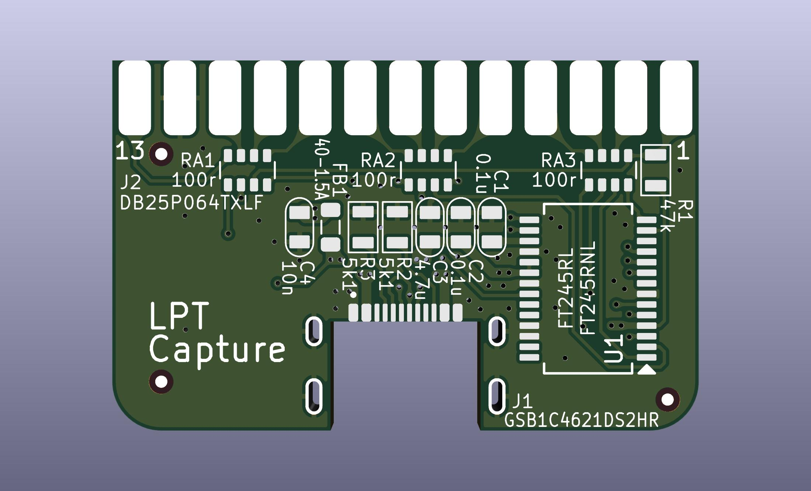
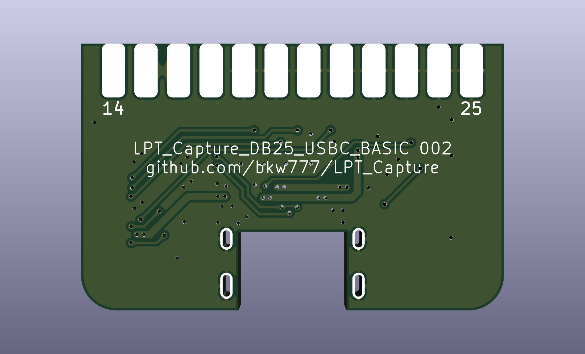
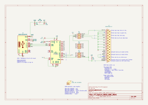

# LPT Capture
Capture the output from a parallel printer port.

WIP NOT TESTED

* DB25
* USBC

<!-- PCB: [PCBWAY](https://www.pcbway.com/project/shareproject/LPT_Capture.html)  -->
BOM: [bom.csv](PCB/out/LPT_Capture_DB25_USBC_BASIC.bom.csv) <!-- [DigiKey](https://www.digikey.com/short/j7w00c9c) -->

# Credits
[LptCap](https://www-user.tu-chemnitz.de/~heha/basteln/PC/LptCap/index.en.htm)
