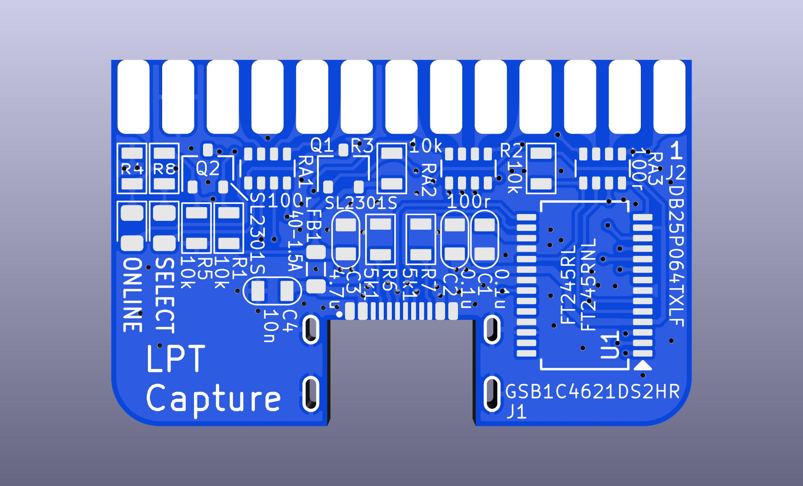
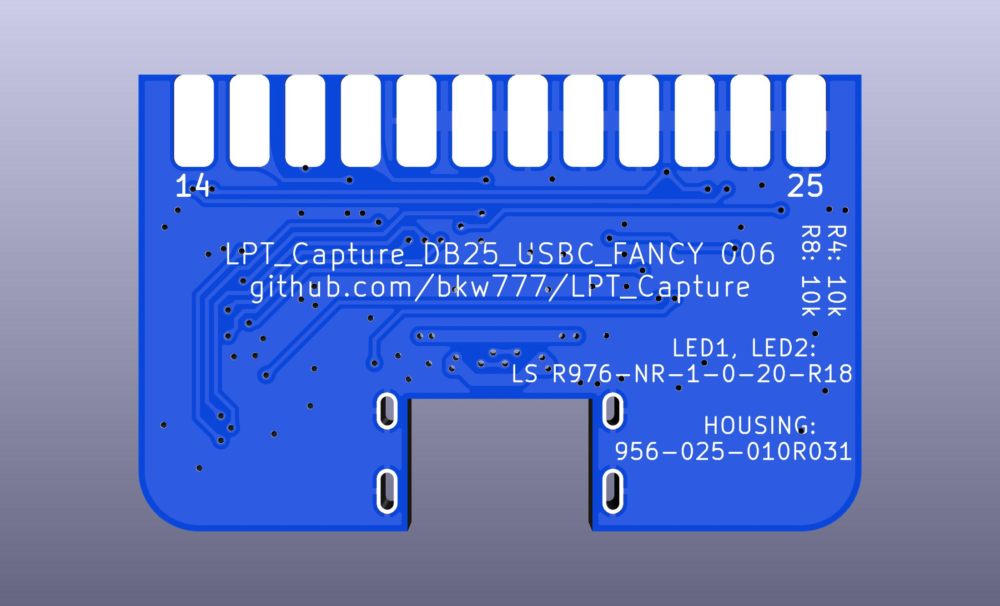
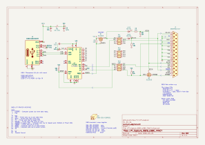

# LPT Capture

WIP NOT TESTED

* DB25
* USB-C  
* ONLINE, /RESET, /SELIN  
* LEDS on ONLINE, /SELIN

<!-- PCB: [OSHPark](https://oshpark.com/shared_projects/DqbtiuyI), [PCBWAY](https://www.pcbway.com/project/shareproject/LPT_Capture.html)  -->
BOM: [bom.csv](PCB/out/LPT_Capture_DB25_USBC_FANCY.bom.csv)  <!-- [DigiKey](https://www.digikey.com/short/hpfd7prz) -->

# Credits
[LptCap](https://www-user.tu-chemnitz.de/~heha/basteln/PC/LptCap/index.en.htm)
